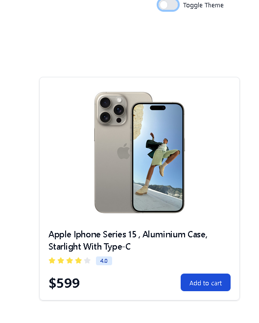
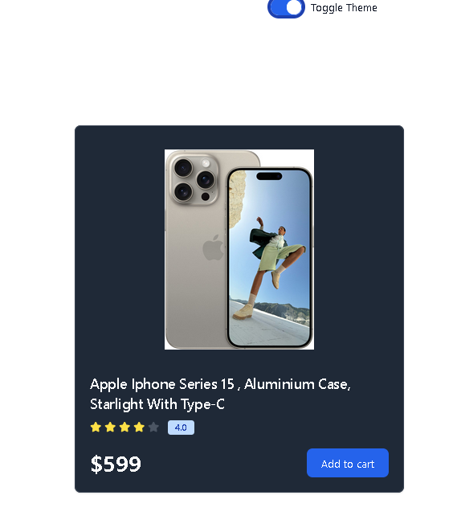

# PRODUCT CARD WITH DARK BUTTON

A Simple Product Card   Built with  React.js/Tailwindcss that is basically a Product Card Comes With Dark mode Feature Button.

## Features

- Responsive And Static Product Card

- Light Mode And Dark Mode Funcationality

## Screenshots

## Getting Started

 Follow these instructions to get a copy of the project up and running on your local machine.

### Prerequisites

 - Node.js
 - React.js
 - That two Application Must Be Installed in your System Before Starting The Application

 ### Installing
 1. Clone the repository:

 git clone https://github.com/ssdevloper/Product_Card.git

 ### Run Command
 cd productcard

 npm Install

 npm run dev

### Author

Shubham Singh